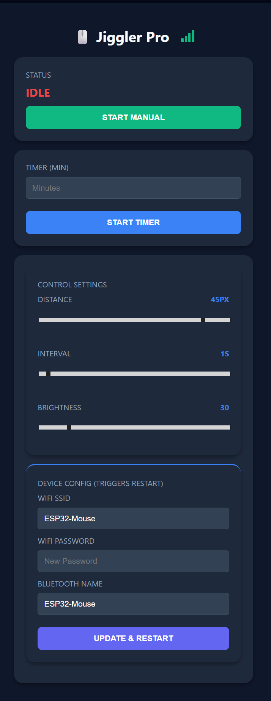

# ESP32-S3 Bluetooth Mouse Jiggler Pro v6.0 🖱️⚡

This project turns an ESP32-S3 into a Bluetooth HID mouse that moves automatically to prevent your computer from going to sleep or showing as "Away". It includes a Wi-Fi web interface to control all settings from your smartphone.

## 🌟 Features
* **Dual-Mode**: Works as a Bluetooth Mouse and a Wi-Fi Access Point simultaneously.
* **Web Dashboard**: Control everything via browser (192.168.4.1) with no page reloads.
* **Custom Identity**: Change the **Bluetooth Name**, **Wi-Fi SSID**, and **Password** directly on the web page.
* **Timer**: Set a countdown in minutes to stop the movement automatically.
* **Adjustable Settings**: 
    * **Distance**: How far the cursor moves (1px to 50px).
    * **Interval**: Time between movements (1s to 60s).
    * **Brightness**: Control the onboard RGB LED intensity.
* **Memory**: Saves all your configurations automatically.
* **RGB Status**: 
    * 🔴 **Blinking Red**: Searching for Bluetooth.
    * ⚪ **Dim Gray**: Connected and waiting.
    * 🟢 **Green Blink**: Moving mouse.

---

## 🛠️ Hardware Compatibility
Tested on:
* **Board**: ESP32-S3 DevKitC-1 (**N16R16 variant**)
* **Flash/PSRAM**: 16MB / 16MB
* **RGB LED**: Internal Pin 48

---

## 🚀 Installation Guide

### 1. Libraries Setup (Important)
To handle Bluetooth HID, you need specific libraries:

1. **BLE Mouse Library**:
   * Download the ZIP from: [https://github.com/wakwak-koba/ESP32-NimBLE-Mouse](https://github.com/wakwak-koba/ESP32-NimBLE-Mouse)
   * In the Arduino IDE, go to **Sketch** -> **Include Library** -> **Add .ZIP Library...** and select the downloaded file.
2. **NimBLE-Arduino**:
   * In the Arduino IDE, go to **Tools** -> **Manage Libraries...**
   * Search for **"NimBLE-Arduino"** by h2zero and install it.
3. **NeoPixel**:
   * Search for **"Adafruit NeoPixel"** in the Library Manager and install it.

### 2. Board Settings (Dev Kit N16R16)
Configure your Arduino IDE under **Tools**:
* **Board**: "ESP32S3 Dev Module"
* **USB CDC On Boot**: "Enabled"
* **Flash Mode**: "QIO 80MHz"
* **Flash Size**: "16MB"
* **PSRAM**: "OPI PSRAM"
* **Partition Scheme**: "16M Flash (3MB APP/9.9MB FATFS)"

### 3. Uploading
1. Place `MouseJiggler.ino` and `index.h` in a folder named `MouseJiggler`.
2. Open the `.ino` file, select your COM port, and click **Upload**.

---

## 📱 How to Use
1. Power the ESP32 via USB.
2. Connect your phone to Wi-Fi: **"ESP32-Mouse-Config"** (Pass: `12345678`).
3. Open `192.168.4.1` in your mobile browser.
4. Pair your PC's Bluetooth with the device (default: **"ESP32-MouseJiggler"**).
5. Start the jiggler from the web interface.

---

## 📁 Project Structure
* `MouseJiggler.ino`: Main logic and server.
* `index.h`: Web interface code.

## ⚠️ Disclaimer
This tool is for educational use and personal productivity. Check your local IT policies before use.